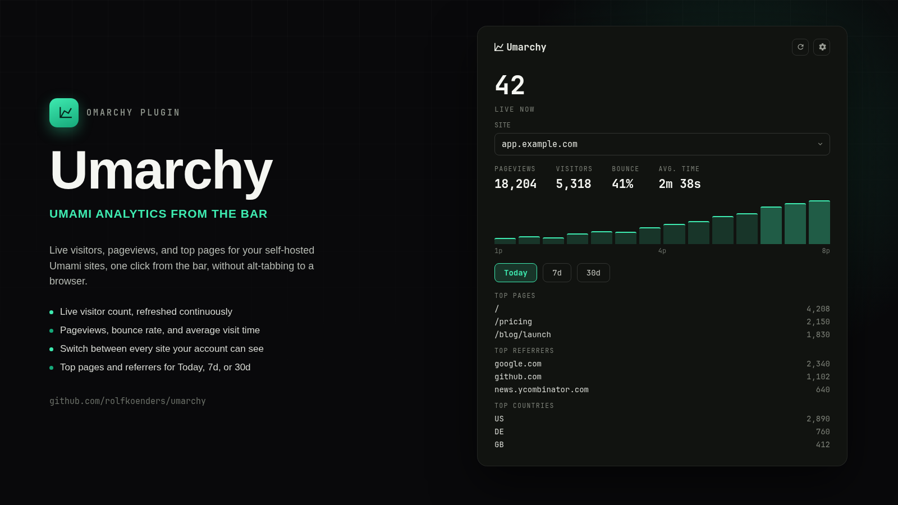

# Umarchy



Umami analytics in the Omarchy bar. Live visitor count, pageviews, bounce
rate and average visit time, a pageviews-over-time chart, and top
pages/referrers/countries — switchable between every site your account can
see, one at a time.

> Not affiliated with or endorsed by Umami Software, Inc.

## Install

```bash
omarchy plugin add https://github.com/rolfkoenders/umarchy.git --enable
```

## Setup

Umarchy connects directly to your self-hosted Umami instance's API. It does
not use Umami Cloud.

1. In Umami, create a dedicated **View Only** team member account scoped to
   the site(s) you want in the bar, rather than using your admin login —
   this plugin never needs write access to anything.
2. Open the Umarchy widget, select **Settings**.
3. Enter your instance URL (e.g. `https://analytics.example.com`), the
   view-only username, and its password, then **Save & Connect**.

Self-hosted Umami has no simple API key (that's a Cloud-only feature) — the
password is used once to log in and get a session token, then stored in your
system's GNOME Keyring via `secret-tool` so it isn't needed again until the
token expires or is rejected. The password is never written to this
plugin's own config file.

### Configuration

| Setting | Description |
| --- | --- |
| Instance URL | Your Umami server, e.g. `https://analytics.example.com` |
| Username | A view-only Umami account's username |
| Password | That account's password (kept only in the system keyring) |
| Live count on the bar | Show the live visitor count next to the icon, or just the icon |

Site and time-period selection live in the panel itself (a site picker when
your account can see more than one site; Today / 7d / 30d chips), not in
these settings.

## Features

- Live visitor count ("LIVE NOW"), refreshed continuously while configured.
- Pageviews, visitors, bounce rate and average visit time for the selected
  period.
- A pageviews-over-time chart (hourly for Today, daily for 7d/30d).
- Top pages, top referrers, and top countries for the selected period.
- Switch between every site the account can see — no aggregation across
  sites, since unrelated websites' traffic isn't meaningfully summable.
- Middle-click the bar icon to refresh; right-click to open the instance in
  your browser.
- Automatic re-login, once, if the session token is rejected — you're only
  ever prompted again if the saved password itself no longer works.

## Security

- The login password lives only in GNOME Keyring (`secret-tool`), keyed by
  instance host and username. It is never written to this plugin's config
  file or passed on any process's command line.
- Every Umami API call — including login — happens in a short-lived Python
  helper process (`bin/umami-api`), not inside the long-lived Quickshell
  process. QML's own `XMLHttpRequest` can't safely bound an untrusted
  response: Qt materializes every received byte into memory as it streams
  in, before any JS callback gets a chance to inspect or abort it. The
  helper instead enforces a byte cap and a wall-clock deadline during its
  own socket read, refuses to follow HTTP redirects (which could otherwise
  resend the session token to an unintended host), and only ever hands the
  shell process already-bounded output.
- Response shape (list length, individual field length) is capped again on
  the QML side before anything is bound to a list — a response under the
  byte cap can still be an enormous list of tiny records, and either becomes
  real UI cost once rendered.
- The instance URL is validated as a plain `http(s)://host` before it's
  saved or ever used, including for the "open in browser" action, which only
  ever opens that saved URL — never anything server-supplied.

## Requirements

- Omarchy Quattro v4.
- `python3` (stdlib only — no pip dependencies).
- `secret-tool` (GNOME Keyring) for password storage.
- A reachable Umami instance and a view-only account on it.

## License

[MIT](LICENSE) — Copyright (c) 2026 Rolf Koenders
